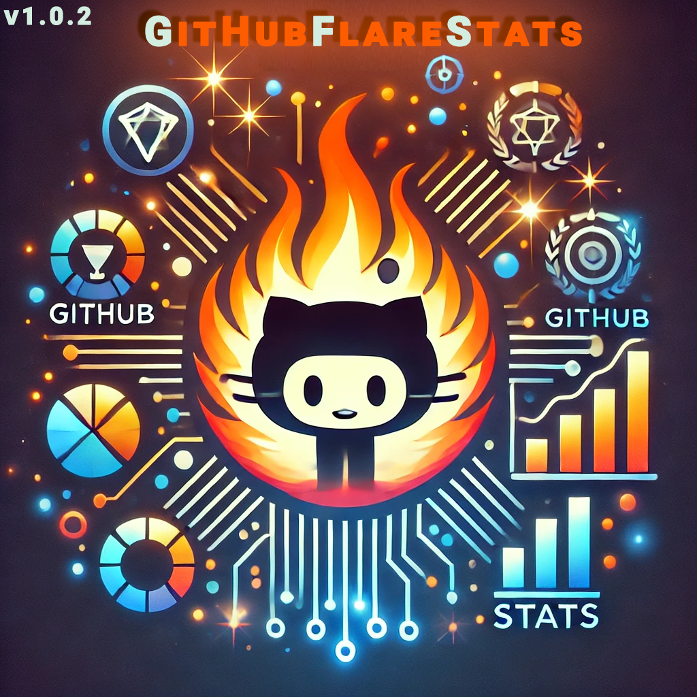

# GithubFlareStats 
<div align="right">
  <sub>- <a href="https://github.com/openlab-x/GitHubViewsCounter">Made With GitHubViewsCounter</a></sub>
</div>



 
## About

**GithubFlareStats** is an open-source tool designed to generate dynamic, customizable images for displaying GitHub user statistics. It supports multiple themes and allows you to embed these stats into your GitHub profile README or any other markdown-supported platform. Display stars, commits, pull requests, issues, and much more in a visually appealing format. The versatility of this tool allows anybody to display their stats in the manner that they like


## Table of Contents

- [About](#about)
- [Features](#features)
- [Getting Started](#getting-started)
- [Platforms Tested](#platforms-tested)
- [Live Demo and Examples:](#live-demo-and-examples)
  - [Customization](#customization)
  - [Examples URLs](#examples-urls)
- [Usage](#usage)
- [Technology Stack](#technology-stack)
- [Contributing](#contributing)
- [Acknowledgments](#acknowledgments)
- [Bug Reporting](#bug-reporting)
- [License](#license)
- [Code of Conduct](#code-of-conduct)
- [Contact](#contact)

## Features

- **Display GitHub Stats**: Showcase total stars, commits, PRs, issues, discussions, followers, and contributions.
- **Customizable Themes**: Modify background, text, and card colors via URL parameters to match your profile style.
- **Embed-Friendly**: Supports markdown embedding for GitHub profile readme files and other markdown-supported platforms.
- **Responsive**: Dynamically adjusts to different screens and usage contexts.

## Getting Started
- **Dependencies**: Python3, Flask, Pillow<br/><br/>
- First up, install flask and pillow
```bash
pip install flask
pip install pillow
```
- Then, clone the repository and execute run.py
```cmd
git clone https://github.com/openlab-x/GithubFlareStats.git
cd GithubFlareStats
python run.py
```
It is very important to make sure your libraries are updated to the latest version, as those are the versions used in this repository

## Platforms Tested
- [x] Web: Fully functional on major browsers like Chrome, Firefox, and Edge.
- [x] Github Readme-md.
- [x] Local Readme-md.
- [x] Visual studio code readme preview.
- [x] As an external image for any webstie.
- [x] As an Iframe.

## Live Demo and Examples:


  - **Light Mode - Live:**
  - https://github.com/ajee10x
  - 
  - [Made With GithubFlareStats](https://github.com/openlab-x/GithubFlareStats)


  - **Dark Mode - Live:**
  - https://github.com/Alaa-abdulridha
  - 
  - [Made With GithubFlareStats](https://github.com/openlab-x/GithubFlareStats)

### Customization

| Parameter | Description |
| --- | --- |
| bgColor | Background color (e.g., #ffffff) |
| textColor | Text color (e.g., #000000) |
| cardColor | Card background color (e.g., #e1e1e1) |
| chartColor | Color for chart bars (e.g., #007bff) |
| chartTextColor | Text color for chart labels (e.g., black) |


### Examples URLs

  - **Embed Light Mode Example:**
  ```md
    
- [Made With GithubFlareStats](https://github.com/openlab-x/GithubFlareStats)
  ```
  - **Embed Dark Mode Example:**
  ```md
    
- [Made With GithubFlareStats](https://github.com/openlab-x/GithubFlareStats)
  ```


## Usage

1. Replace ajee10x/torvalds with your GitHub username in the demo URL:
  ```md
    )
- [Made With GithubFlareStats](https://github.com/openlab-x/GithubFlareStats)
  ```
2. Paste this link into your README or any markdown-supported content to showcase your GitHub stats.
  ```md
    )
- [Made With GithubFlareStats](https://github.com/openlab-x/GithubFlareStats)
  ```
3. With a custom URL, your link will look like this.
  ```md
    )
  ```

## Technology Stack
- Backend: Python (Flask for serving the image generation)
- Frontend: HTML, CSS, JavaScript (for theme preview and demo page)
- Image Processing: Pillow (Python Imaging Library)
- Data Caching: Implemented to reduce API calls and cache images for 24 hours.
- Proxy: PHP used as a lightweight proxy to route requests and manage caching.
- Hosting: Deployed to a production-ready hosting environment.
- Security: Software tested for common vulnerabilites, notably XSS and SQL Injection. You are safe to run this on your server!

## Contributing
 We welcome contributions! Here's how you can help:
  
  1. Give the project a STAR.
  2. Follow us on Github.
  3. Follow us on Social Media.
  4. Fork the repository.
  5. Create a new branch for your feature or bug fix.
  6. Make your changes.
  7. Submit a pull request.
  8. Please make sure to update tests as appropriate.


## Acknowledgments
- Python: The programming language used for the backend of this project.
- Pillow: For enabling image manipulation and rendering in Python.
- GitHub API: For providing the data used in generating user stats.
- Stats are updated every 24 hours automatically to prevent excessive API requests and to ensure that the service remains efficient and avoids hitting rate limits.
- All Contributors: Thanks to everyone who contributed to the project.
- OpenLabX Team: Special thanks to the team for developing and maintaining the project.

## Bug Reporting
- If you find a bug in this project, please do not hesistate to reach out to our team
- If you are feeling helpful, please consider fixing the bug and making a pull request
- We give our greatest thanks to any people who report or fix bugs in this project
  
## License
This project is licensed under the [MIT license](LICENSE).

## Code of conduct

We are committed to fostering an open and welcoming environment. All participants in this project are expected to adhere to our [Code of Conduct](CODE_OF_CONDUCT.md), which outlines our expectations for respectful behavior and the steps for reporting unacceptable conduct.

## Contact

In pursuit of innovation,  
**OpenLabX Team**

- **Website**: [https://openlabx.com](https://openlabx.com)
- **Email**: contact@openlabx.com

**Follow Us:**

<div align="center">
| <a href="https://www.instagram.com/openlabx_official/" target="_blank"><strong>Instagram</strong></a> |
<a href="https://x.com/openlabx" target="_blank"><strong>X (formerly Twitter)</strong></a> |
<a href="https://www.facebook.com/openlabx/" target="_blank"><strong>Facebook</strong></a> |
<a href="https://www.youtube.com/@OpenLabX" target="_blank"><strong>YouTube</strong></a> |
<a href="https://github.com/openlab-x" target="_blank"><strong>GitHub</strong></a> |
</div>
